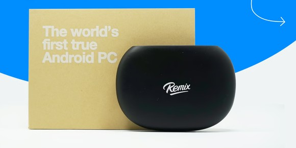

# Jide Remix Mini: boot Armbian from the internal eMMC (no microSD)

<p align="center"><a href="https://www.kickstarter.com/projects/jidetech/remix-mini-the-worlds-first-true-android-pc/faqs"></a><br><sub>Jide Remix Mini — original Kickstarter campaign (2015). Image © Jide Technology.</sub></p>

*[Leer en español](README.es.md)*

The **Jide Remix Mini** ([original Kickstarter campaign](https://www.kickstarter.com/projects/jidetech/remix-mini-the-worlds-first-true-android-pc/faqs)) (model RM1G, Allwinner H64/A64, 1–2 GB RAM, 8/16 GB eMMC) was a 2015 Android-based mini PC that ended up as e-waste: its SoC has the *secure boot* fuse burned, so it refuses standard bootloaders. Since 2025 it can boot Armbian from a microSD with a community bootloader, but the internal eMMC was reported as unusable.

This repo takes the last step: **a TOC0-signed U-Boot built from mainline sources that boots from the eMMC**, plus a script that moves a running Armbian from the microSD to the eMMC. Result: a small, fanless ARM64 Debian box with no card inserted.

**Status:** working on a Remix Mini 2 GB / 16 GB (RM1G), Armbian 26.8.1 (Debian trixie, kernel 6.18.43), October 2026. One unit tested so far; reports welcome.

## What works

| Feature | Status |
|---|---|
| Boot from eMMC without microSD | ✅ |
| HDMI console | ✅ |
| WiFi (Realtek, 2.4 GHz) | ✅ |
| USB 2.0 ports | ✅ |
| All 4 cores, 2 GB RAM | ✅ |
| **Ethernet** | ❌ Not supported: the 100 Mbps PHY is an X-Powers **AC200**, which has no mainline driver. The upstream DTB disables it. Use WiFi or a USB-Ethernet adapter (RTL8152/8153, ASIX). |
| Boot from USB without SD/eMMC | ❌ Impossible: the BROM only knows SD, eMMC and FEL. (The U-Boot here tries USB *after* the eMMC, so in principle the root filesystem could live on a USB drive; untested.) |

## Why this is needed

- The SoC's BROM only accepts **TOC0**-wrapped boot code (Allwinner "secure boot"). Standard `eGON` images are ignored.
- No root-key hash is burned into the fuses, so **any RSA key works**: U-Boot can generate the TOC0 image itself (`CONFIG_SPL_IMAGE_TYPE_SUNXI_TOC0`).
- Boot order is fixed in ROM: **microSD → eMMC → FEL**. A valid TOC0 on the SD always wins, which makes this procedure safe: if the eMMC fails to boot, insert the SD again.
- Mainline Linux has the board DTS since v6.9 (`sun50i-h64-remix-mini-pc`), and U-Boot now ships it via `dts/upstream`. The `remix-mini-pc_defconfig` posted upstream in 2024 was never merged, so this repo provides one.

## Procedure

You need: a microSD (any size ≥ 8 GB, ideally A1/A2), an HDMI screen + USB keyboard for the first boot, and a Linux machine (or WSL) to prepare the card.

### 1. Boot Armbian from microSD (community method)

Follow [penzoiders' gist](https://gist.github.com/penzoiders/582bfab2c9265716dd375fb5e7679bcf):

1. Write the **Armbian image for Pine64** to the microSD (balenaEtcher, Rufus or `dd`).
2. Download the "magic" boot blob `remixmini_boot_gap_8k_to_1m.bin` (links in the gist) and write it **after the first 8 KiB**:
   ```sh
   sudo dd if=remixmini_boot_gap_8k_to_1m.bin of=/dev/sdX bs=1024 seek=8 conv=fsync,notrunc
   ```
   On Windows, [`tools/write-boot-blob-windows.py`](tools/write-boot-blob-windows.py) does the same with safety checks.
3. Boot the Remix Mini. Default Armbian login: `root` / `1234` (you'll be asked to change it).

> Untested alternative: writing this repo's U-Boot to the SD at 8 KiB instead of the blob should also work, since it supports both MMC0 (SD) and MMC2 (eMMC). If you try it, please open an issue with the result.

### 2. Switch to the Remix Mini device tree

Armbian for Pine64 boots with the Pine64 DTB. Use the board's own DTB (eMMC enabled, correct WiFi):

```sh
sudo nano /boot/armbianEnv.txt
# set (or replace) this line:
fdtfile=allwinner/sun50i-h64-remix-mini-pc.dtb
sudo reboot
```
Check with `cat /proc/device-tree/model` → `Remix Mini PC`.

### 3. Connect to WiFi

Minimal images don't include `nmtui`; use `armbian-config` → Network → WiFi. Then continue over SSH (much easier than the console with a non-US keyboard).

### 4. Copy this repo to the device and run the diagnostics

```sh
git clone https://github.com/christiannieveslauz/remix-mini-emmc.git && cd remix-mini-emmc
sudo bash scripts/install-emmc.sh          # read-only diagnostics
```
Expected (from the tested unit):
```
eMMC:           /dev/mmcblk2
  read OK
  /dev/mmcblk2boot0: no TOC0
  /dev/mmcblk2boot1: no TOC0
  user area @8K: has TOC0 (stock Remix OS bootloader)
Boot configuration bytes [PARTITION_CONFIG: 0x00]
 Not boot enable
```
`PARTITION_CONFIG: 0x00` means the eMMC hardware boot partitions are not used, so the BROM reads the bootloader from the user area at 8 KiB — exactly where the stock one lives and where ours goes.

### 5. Install

```sh
sudo bash scripts/install-emmc.sh --install
```
It will:
1. `apt-mark hold` Armbian's `linux-u-boot-*` package (an update would overwrite the bootloader with a non-TOC0 Pine64 one and brick the boot — recoverable with the SD, but annoying).
2. Back up the **whole eMMC** (stock Remix OS) to `/root/emmc-original/` on the SD — about 11 minutes at ~23 MB/s.
3. Create one ext4 partition at 4 MiB, rsync the running system, update `rootdev` in `armbianEnv.txt` and `/etc/fstab`.
4. Write the TOC0 U-Boot to the eMMC at 8 KiB.

Then `poweroff`, remove the microSD, power on.

### Restore the stock eMMC

Boot from SD and: `sudo dd if=/root/emmc-original/emmc.img of=/dev/mmcblk2 bs=4M conv=fsync`.

## Building U-Boot yourself

```sh
./build.sh          # Debian/Ubuntu x86_64; installs the cross toolchain
```
It fetches pinned commits of U-Boot and Trusted Firmware-A, builds BL31 (`PLAT=sun50i_a64`), then U-Boot with [`configs/remix-mini-pc_defconfig`](configs/remix-mini-pc_defconfig):

```
CONFIG_DEFAULT_DEVICE_TREE="sun50i-h64-remix-mini-pc"
CONFIG_MACH_SUN50I=y
CONFIG_MMC_SUNXI_SLOT_EXTRA=2        # eMMC on SMHC2
CONFIG_SPL_IMAGE_TYPE_SUNXI_TOC0=y   # signed image the BROM accepts
```
A new RSA key is generated per build, so **your checksum will differ** from the prebuilt binary; that is expected. The build warns that SCP firmware is missing — it is only needed for suspend.

Notes for anyone reproducing earlier attempts: starting from this minimal defconfig there was no SPL SRAM overflow and no need for custom `-u-boot.dtsi` files; the upstream DTS already enables the SD and eMMC controllers.

| File | SHA-256 |
|---|---|
| `prebuilt/remixmini-uboot-emmc-toc0.bin` | see [`prebuilt/SHA256SUMS`](prebuilt/SHA256SUMS) |

Built from U-Boot `10adf52ed29d` (2026-10-07) and TF-A `510355478850` (2026-10-05), GCC 13.3 (aarch64-linux-gnu).

## Post-install tips

- Rename the host: `sudo hostnamectl set-hostname remix` (it stays `pine64` otherwise).
- Keep `linux-u-boot-*` on hold. Kernel and userland updates are fine.
- The kernel still reports `v26.x for Pine64` in the MOTD; that is cosmetic.

## Credits

- [linux-sunxi wiki](https://linux-sunxi.org/Jide_Remix_Mini) and Andre Przywara for the mainline DTS, TOC0 support and the original defconfig patch.
- [penzoiders (Lorenzo Faleschini)](https://gist.github.com/penzoiders/582bfab2c9265716dd375fb5e7679bcf) for the first working SD boot.
- [Matt Miller](https://dev.to/matemiller/reviving-the-remix-mini-pc-a-guide-to-running-arm-based-os-images-1jcc), [r4nd3l](https://github.com/r4nd3l/revived_remix_mini_pc) and the [Armbian forum thread](https://forum.armbian.com/topic/56916-jide-remix-mini-1g2g-can-now-since-february-use-unofficial-armbian/).
- eMMC boot: Christian Nieves ([christiannieves.uy](https://christiannieves.uy)).

## License

Scripts and config: GPL-2.0-or-later. The prebuilt binary is U-Boot (GPL-2.0+) and TF-A (BSD-3-Clause); sources are the pinned upstream commits above.

*No warranty. This erases the stock Remix OS on the eMMC (a full backup is taken first).*
